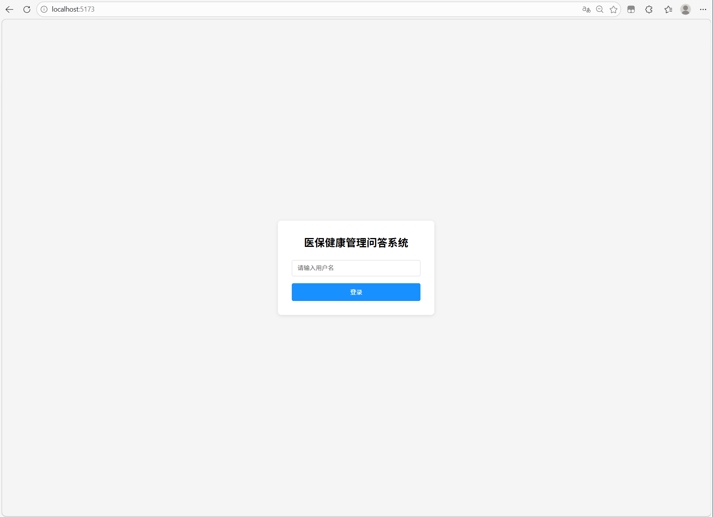
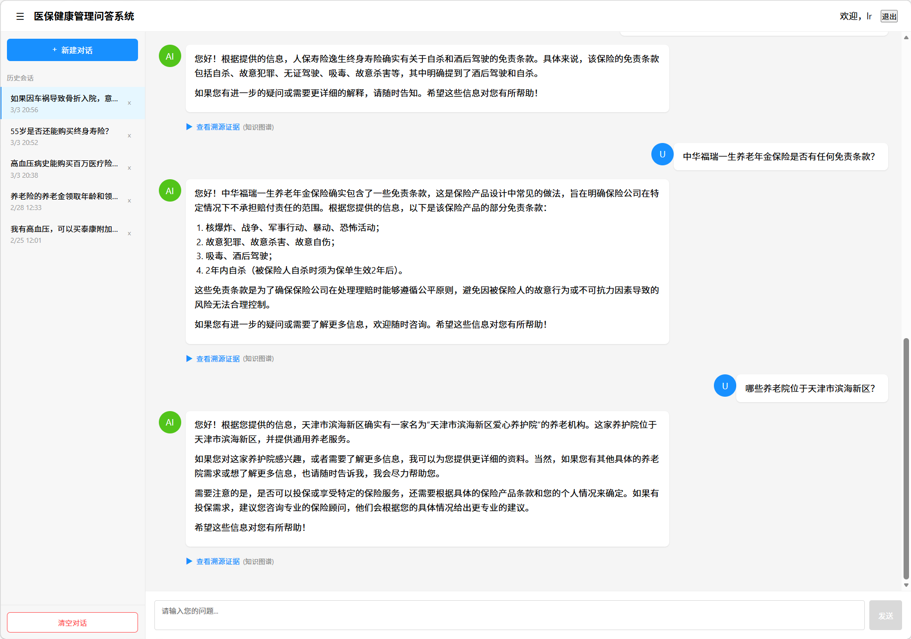
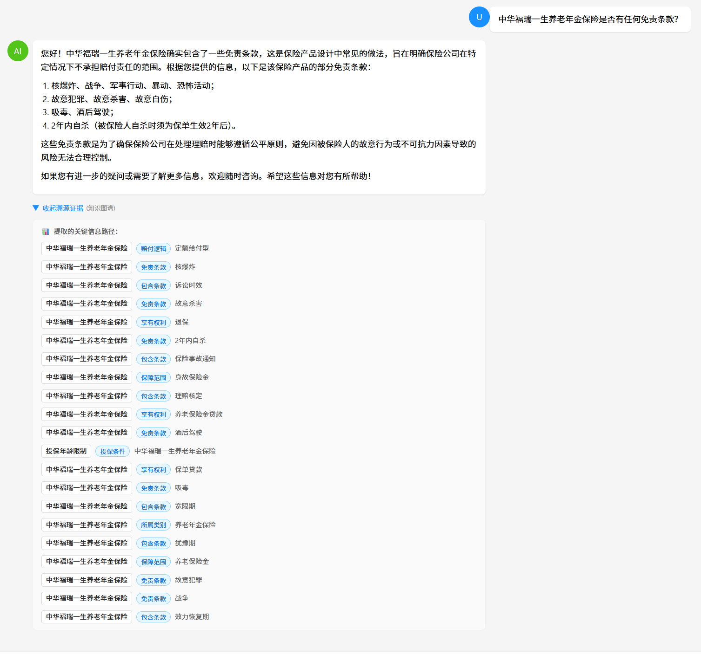
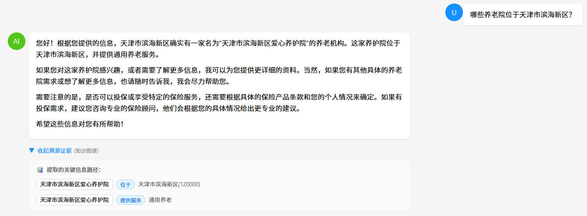
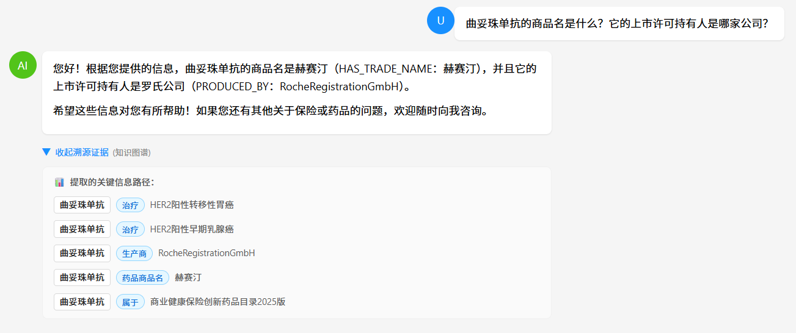

# "保险+医养"知识图谱与 GraphRAG 问答系统技术报告

- github仓库地址：https://github.com/aRay643/Insurance-Medicare-GraphRAG.git

## 一、产品截图展示
---
### 登录界面

### 主页面

### 保险问题

### 康养之家

### 药物问题

---

## 二、项目概述

本项目是一个基于 GraphRAG（Graph Retrieval-Augmented Generation）架构的"保险+医养"领域智能问答系统。该系统将保险条款、药品目录、养老机构等多源异构数据转化为结构化知识图谱，并结合大语言模型实现自然语言问答与可溯源回答。

---

## 三、验收清单完成情况

### 3.1 知识图谱（Neo4j 格式）

| 指标 | 数量 | 要求 | 状态 |
|------|------|------|------|
| 节点总数 | **83,105** | ≥500 |超额完成 |
| 关系总数 | **385,769** | ≥1000 |超额完成 |

**数据构成明细**：

| 数据类型 | 数量 | 说明 |
|----------|------|------|
| 保险产品 | 105 个 | 涵盖意外险、医疗险、重疾险、年金险等 |
| 养老机构 | 56,368 个 | 涵盖机构养老、社区养老、居家养老等 |
| 药品实体 | 23 个 | 商业创新药目录 |
| 疾病百科 | 8,807 个 | 疾病定义与分类 |
| 症状 | 5,997 个 | 临床症状 |
| 治疗方式 | 544 个 | 手术、化疗、放疗等 |
| 检查项目 | 3,353 个 | 体检与检测项目 |
| 保障项目 | 166 个 | 保险赔付项目 |
| 免责条款 | 177 个 | 责任免除情形 |

### 3.2 GraphRAG 问答系统

| 功能模块 | 实现状态 | 核心文件 |
|----------|----------|----------|
| 实体提取 |完成 | `mock/graphrag-new2.py` |
| 图谱检索 |完成 | `mock/graphrag-new2.py` |
| 答案生成 |完成 | `mock/graphrag-new2.py` |
| 证据溯源 |完成  | `frontend/src/pages/Chat.tsx` |
| API 接口 |完成 | `POST /api/v1/chat` |

---

## 四、本体设计

### 4.1 总体架构

本系统采用**领域驱动设计（DDD）**策略，将知识图谱划分为三个核心领域：

```
┌─────────────────────────────────────────────────────────────────┐
│                      保险+医养知识图谱                              │
├─────────────────┬─────────────────────┬─────────────────────────┤
│   保险领域       │     医疗领域          │      养老领域            │
│  (Insurance)    │    (Medicine)       │    (Nursing)           │
├─────────────────┼─────────────────────┼─────────────────────────┤
│ • 产品          │ • 药品               │ • 机构                  │
│ • 保障责任      │ • 疾病               │ • 行政区划              │
│ • 免责条款      │ • 症状               │ • 服务类型              │
│ • 投保条件      │ • 治疗方式           │                        │
└─────────────────┴─────────────────────┴─────────────────────────┘
```

### 4.2 保险领域本体（Insurance Ontology）

**节点类型（Node Labels）**：

| 类型标识 | 英文名称 | 中文说明 | 示例 |
|----------|----------|----------|------|
| `Product` | 保险产品 | 本合同的主险或附加险名称 | 泰康附加长期意外伤害保险 |
| `ProductCategory` | 产品类别 | 保险产品所属的大类 | 意外伤害保险、医疗保险 |
| `Benefit` | 保障责任 | 具体的赔付项目 | 一般意外伤残保险金 |
| `Condition` | 保险术语 | 时间或契约约束 | 等待期、犹豫期、宽限期 |
| `Exclusion` | 责任免除 | 导致不赔的行为或疾病 | 醉酒、高风险运动 |
| `Medical` | 医疗实体 | 疾病、药品、手术或治疗方案 | 恶性肿瘤-重度 |
| `Eligibility` | 人群限制 | 年龄、职业等级或性别的准入描述 | 年龄限制18-65周岁 |
| `Service` | 服务类型 | 护理或医疗服务 | 机构护理服务、居家护理服务 |

**关系类型（Edge Definitions）**：

```
┌─────────────────────────────────────────────────────────────────────────────┐
│                          保险领域关系图谱                                    │
├─────────────────────────────────────────────────────────────────────────────┤
│                                                                             │
│    Product ────── BELONGS_TO_CATEGORY ──────► ProductCategory            │
│       │                                                  │                   │
│       ├── HAS_PAYOUT_LOGIC ──────────────► Benefit (Reimbursement/Fixed)  │
│       │                                                  │                   │
│       ├── HAS_TERM ───────────────────────► Condition                      │
│       │                                                  │                   │
│       ├── COVERS ─────────────────────────► Benefit                        │
│       │                                                  │                   │
│       ├── HAS_EXCLUSION ──────────────────► Exclusion                     │
│       │                                                  │                   │
│       ├── COVERS_TREATMENT ───────────────► Medical                        │
│       │                                                  │                   │
│       └── COVERS_SERVICE ──────────────────► Service                        │
│                                                                             │
│    Eligibility ─── ELIGIBILITY ──────────────► Product                      │
│                                                                             │
│    Medical ────── COVERED_BY ───────────────► Product                      │
│                                                                             │
└─────────────────────────────────────────────────────────────────────────────┘
```

**关系属性示例**：

| 关系类型 | 必须属性 | 说明 |
|----------|----------|------|
| `BELONGS_TO_CATEGORY` | `category_code` | 类别代码（accident/medical/critical_illness 等） |
| `HAS_PAYOUT_LOGIC` | `logic_type` | 定额给付型(Fixed) / 费用补偿型(Reimbursement) |
| `HAS_TERM` | `days`, `is_mandatory` | 天数、是否强制 |
| `COVERS` | `payout_basis`, `waiting_period_payout` | 给付基础、等待期给付 |
| `ELIGIBILITY` | `age_min`, `age_max`, `health_requirement` | 最小年龄、最大年龄、健康要求 |

### 4.3 医疗领域本体（Medicine Ontology）

**节点类型**：

| 类型 | 说明 |
|------|------|
| `Product` | 药品通用名（全局唯一ID） |
| `Brand` | 药品商品名 |
| `Company` | 上市许可持有人（药企） |
| `Medical` | 适应症、疾病名称 |
| `Insurance` | 药品目录名称 |

**关系定义**：

```
(Product) --[HAS_TRADE_NAME]--> (Brand)      药品→商品名
(Product) --[PRODUCED_BY]--> (Company)       药品→药企
(Product) --[TREATS]--> (Medical)            药品→治疗疾病
(Product) --[BELONGS_TO]--> (Insurance)      药品→所属目录
```

### 4.4 养老领域本体（Nursing Ontology）

**节点类型**：

| 类型 | 说明 |
|------|------|
| `Org` | 养老机构 |
| `District` | 行政区划（最小单位：区/县） |
| `Province` | 省份 |
| `Service` | 服务类型 |

**关系定义**：

```
(Org) --[LOCATED_IN]--> (District)           机构所在区域
(District) --[BELONGS_TO]--> (Province)       行政归属
(Org) --[PROVIDES_SERVICE]--> (Service)       机构提供的服务类型
```

---

## 五、GraphRAG 流程设计

### 5.1 整体架构

```
┌─────────────────────────────────────────────────────────────────────────────┐
│                        Insurance+Medicare GraphRAG                           │
├─────────────────────────────────────────────────────────────────────────────┤
│                                                                              │
│  ┌─────────┐     ┌─────────┐     ┌─────────┐     ┌─────────┐              │
│  │  User   │────▶│   Web   │────▶│ FastAPI │────▶│  Neo4j  │              │
│  │ (Input) │     │   UI    │     │ Backend │     │ GraphDB │              │
│  └─────────┘     └─────────┘     └─────────┘     └─────────┘              │
│                                              │           │                   │
│                                              ▼           ▼                   │
│                                        ┌─────────┐   ┌─────────┐             │
│                                        │   LLM   │   │  Graph  │             │
│                                        │ Client  │   │ Engine  │             │
│                                        └─────────┘   └─────────┘             │
│                                              │                               │
│                                              ▼                               │
│                                        ┌─────────┐                         │
│                                        │ Prompt  │                         │
│                                        │ Builder │                         │
│                                        └─────────┘                         │
└─────────────────────────────────────────────────────────────────────────────┘
```

### 5.2 问答处理流程

```
┌─────────────────────────────────────────────────────────────────────────────┐
│                         GraphRAG 问答流程图                                  │
├─────────────────────────────────────────────────────────────────────────────┤
│                                                                             │
│  ┌──────────┐                                                              │
│  │ 用户问题  │  "60岁有高血压能买百万医疗险吗？"                            │
│  └────┬─────┘                                                              │
│       │                                                                     │
│       ▼                                                                     │
│  ┌─────────────┐     Few-Shot 示例引导                                      │
│  │  实体提取   │ ───────────────────────────────────────┐                  │
│  │ (LLM API)   │                                        │                  │
│  └──────┬──────┘                                        │                  │
│         │                                               │                  │
│         ▼                                               ▼                  │
│  ┌─────────────────┐      ┌─────────────────┐  ┌────────────────┐        │
│  │ "60岁,高血压,   │      │ 提取失败触发    │  │ 本地规则兜底   │        │
│  │  百万医疗险"    │      │ 兜底机制        │  │ (fallback)     │        │
│  └────────┬────────┘      └─────────────────┘  └────────────────┘        │
│           │                                                             │
│           ▼                                                             │
│  ┌─────────────────┐                                                    │
│  │  知识图谱检索   │  Neo4j Cypher 查询 + 模糊匹配                        │
│  │ (get_subgraph)  │ ─────────────────────┐                            │
│  └────────┬────────┘                         │                            │
│           │                                   │                            │
│           ▼                                   ▼                            │
│  ┌─────────────────┐      ┌─────────────────┐  ┌────────────────┐        │
│  │ 返回三元组:     │      │ 返回内存数据:   │  │ 合并去重        │        │
│  │ "高血压 →       │      │ "高血压 → 分类  │  │ 返回事实列表    │        │
│  │  被排除 → 百万  │      │   为 → 慢性病"   │  │                │        │
│  │  医疗险"        │      │                 │  │                │        │
│  └────────┬────────┘      └─────────────────┘  └────────┬───────┘        │
│           │                                             │                  │
│           ▼                                             │                  │
│  ┌─────────────────────────────────────────────────────┴───────────────┐   │
│  │                         答案生成 (LLM)                               │   │
│  │  ┌─────────────────────────────────────────────────────────────┐   │   │
│  │  │ • 结论清晰："可以购买" / "无法购买"                          │   │   │
│  │  │ • 原因详细：贴合保险业务逻辑                                   │   │   │
│  │  │ • 事实依据：仅使用检索到的知识图谱事实                         │   │   │
│  │  └─────────────────────────────────────────────────────────────┘   │   │
│  └────────────────────────────────┬────────────────────────────────────┘   │
│                                   │                                          │
│                                   ▼                                          │
│  ┌─────────────────────────────────────────────────────────────────────┐   │
│  │                         返回响应                                      │   │
│  │  {                                                                  │   │
│  │    "answer": "根据查询，60岁且有高血压病史...",                     │   │
│  │    "citations": [                                                   │   │
│  │      {"head": "原发性高血压", "relation": "被排除...", "tail": "..."}│   │
│  │    ],                                                                │   │
│  │    "confidence": "高"                                               │   │
│  │  }                                                                  │   │
│  └─────────────────────────────────────────────────────────────────────┘   │
│                                                                             │
└─────────────────────────────────────────────────────────────────────────────┘
```

### 5.3 核心代码模块

**实体提取模块**（`mock/graphrag-new2.py:300-354`）：

```python
def extract_entities(user_query: str) -> Set[str]:
    """实体提取：优先QwenAPI，失败则自动兜底，加入 Few-Shot 示例"""
    messages = [
        {"role": "system", "content": """你是一个冷酷的保险词汇提取器...
        【示例1】输入：60岁有高血压病史能买百万医疗险吗？
        输出：60岁,高血压病,百万医疗险
        【示例2】输入：如果因车祸导致骨折入院...
        输出：车祸,骨折,意外险,医疗险,理赔款
        【示例3】输入：对比泰康康惠保防癌险和国寿防癌疾病保险，70岁老人选哪个？
        输出：泰康康惠保防癌险,国寿防癌疾病保险,70岁,老人"""},
        {"role": "user", "content": f"输入：{user_query}\n输出："}
    ]
```

**图谱检索模块**（`mock/graphrag-new2.py:357-407`）：

```python
def get_subgraph(entity_name: str, return_json: bool = True):
    """图谱查询接口，优先Neo4j，失败则回退到内存数据"""
    # 1. 模糊匹配实体
    matches = get_close_matches_custom(entity_name, candidates, n=3, cutoff=0.55)
    # 2. Neo4j查询
    query = """
    MATCH (h)-[r]->(t)
    WHERE h.name = $name OR t.name = $name
    RETURN h.name as head, type(r) as relation, t.name as tail
    """
```

---

## 六、Prompt 设计示例

### 6.1 保险条款提取 Prompt

**文件**：`Graph/prompts/insurance_prompt_v6.md`

**核心设计要点**：

1. **角色定义**：精通《保险法》、精算逻辑与语义建模的知识图谱架构师
2. **任务约束**：避免冗余提取，仅提取核心参数
3. **本体指导**：明确节点类型和关系属性

```markdown
# 保险条款全文档结构化提取专家提示词 (V6.0)

## Role
你是一位精通《保险法》、精算逻辑与语义建模的知识图谱架构师，
专门负责将整份保险条款 PDF 转化为支持复杂理赔理算的高精度三元组。

## Mission
阅读整份文档，通过通读、交叉验证、逻辑推理，提取支持
"投保准入、理赔计算、医养融合"场景的结构化数据。

## 重要约束：避免冗余提取

### 通用术语词汇表（仅提取参数）
| 术语类别 | 预置种子术语 | 处理方式 |
|---------|-------------|---------|
| 时间限制 | 犹豫期、等待期、宽限期 | 只提取 days |
| 金额价值 | 现金价值、保单贷款、免赔额 | 只提取 amount/ratio |
| 核心定义 | 意外伤害、全残、不可抗辩条款 | 只建立关系 |

## Extraction Schema (本体定义)

### 1. 实体类型 (Nodes)
| 类型 | 说明 | 示例 |
|------|------|------|
| Product | 保险产品 | 泰康附加长期意外伤害保险 |
| ProductCategory | 产品类别 | 意外伤害保险 |
| Benefit | 保障责任 | 一般意外伤残保险金 |
| Eligibility | 人群限制 | 年龄限制18-65周岁 |

### 2. 关系与属性
| 模式 | 必须属性 |
|------|---------|
| (产品)-[BELONGS_TO_CATEGORY]->(类别) | category_code |
| (产品)-[HAS_PAYOUT_LOGIC]->(逻辑) | logic_type: Fixed/Reimbursement |
| (产品)-[HAS_TERM]->(术语) | days, is_mandatory |
| (产品)-[COVERS]->(责任) | payout_basis, waiting_period_payout |
| (限制)-[ELIGIBILITY]->(产品) | age_min, age_max, health_requirement |
```

### 6.2 实体提取 Prompt（问答系统）

**文件**：`mock/graphrag-new2.py:305-321`

```python
messages = [
    {"role": "system", "content": """你是一个冷酷的保险词汇提取器。
你的唯一任务是从用户输入中提取核心词汇，不要回答问题！不要解释！
提取类别包括：保险产品、疾病症状、年龄、医疗方式、保险术语、养老机构、地域。

【示例 1】
输入：60岁有高血压病史能买百万医疗险吗？
输出：60岁,高血压病,百万医疗险

【示例 2】
输入：如果因车祸导致骨折入院，意外险和医疗险的理赔款是互斥的还是叠加的？
输出：车祸,骨折,意外险,医疗险,理赔款,互斥,叠加

【示例 3】
输入：对比泰康康惠保防癌险和国寿防癌疾病保险，70岁老人选哪个？
输出：泰康康惠保防癌险,国寿防癌疾病保险,70岁,老人

请严格按照上面的【输出】格式返回，用英文逗号分隔，不要带有任何多余的汉字。"""},
    {"role": "user", "content": f"输入：{user_query}\n输出："}
]
```

### 6.3 答案生成 Prompt

```python
prompt = f"""你是资深保险医养顾问，需基于以下事实背景，
用专业、友好的话术回答用户问题，要求：
1. 结论清晰（如"可以购买"/"无法购买"）；
2. 原因详细且贴合保险业务逻辑；
3. 语言温和，符合保险顾问的沟通风格；
4. 仅使用提供的事实，不编造信息；
5. 无相关事实时，明确说明"暂未查询到相关投保信息"。

【事实背景】：
{context}

【用户问题】：{user_query}"""
```

---

## 七、技术特性

### 7.1 核心特性

| 特性 | 说明 |
|------|------|
| **LLM双轨制** | 优先使用 SiliconFlow Qwen2.5，失败时本地兜底 |
| **Few-Shot Learning** | 通过示例提高实体提取准确性 |
| **模糊匹配** | 使用 rapidfuzz/difflib 进行实体对齐 |
| **证据溯源** | 返回三元组作为回答依据，支持前端可视化 |
| **Neo4j 图存储** | 高效存储和查询实体关系 |

### 7.2 跨域桥接

系统建立了保险、医疗、养老三个领域的跨域关联：

| 养老服务类型 | 桥接保险产品 |
|-------------|--------------|
| 专业护理 | 护理保险 |
| 机构养老 | 养老年金保险 |
| 社区养老 | 护理保险 |
| 居家养老 | 护理保险 |
| 含医疗设施机构 | 补充医疗保险 |

---

## 八、附录

### 8.1 数据规模统计

| 指标 | 数量 |
|------|------|
| 节点总数 | 83,105 |
| 关系总数 | 385,769 |
| 保险产品 | 105 |
| 养老机构 | 56,368 |
| 药品实体 | 23 |

### 8.2 关键文件索引

| 文件 | 说明 |
|------|------|
| `mock/graphrag-new2.py` | GraphRAG 主服务 |
| `Graph/prompts/insurance_prompt_v6.md` | 保险本体 Prompt |
| `Graph/prompts/medicine_prompt_v6.md` | 药品本体 Prompt |
| `Graph/prompts/nursing_home_prompt_v6.md` | 养老本体 Prompt |
| `Graph/scripts/import_to_neo4j.py` | 数据导入脚本 |
| `frontend/src/pages/Chat.tsx` | 前端证据展示 |


*报告生成时间：2026-03-03*
*项目版本：v2.3*
